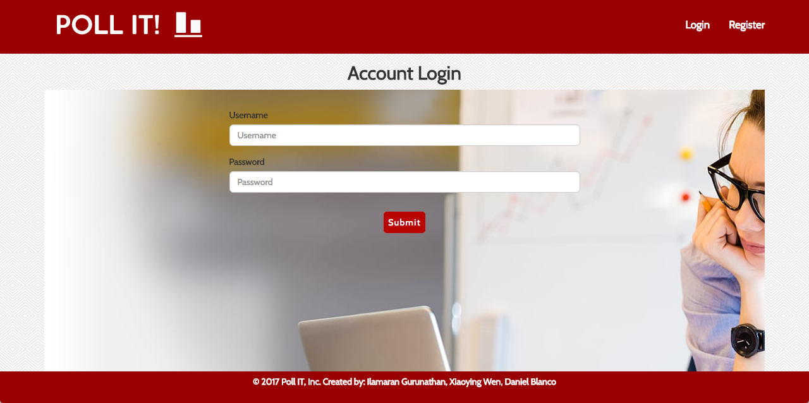

# Poll it!

A user authenticated poll creation app. The user can create a poll of their choosing and have other users cast their votes. The application will then calculate the poll and display the results in google charts.

### Technologies used:
HTML
CSS
Javascript
Node JS
MySQL

### NPM Packages used:
bcryptjs
body-parser
connect-flash
cookie-parser
express
express-breadcrumbs
express-handlebars
express-messages
express-session
express-validator
mongodb
mongoose
mysql
nodemon
passport
passport-http
passport-local
sequelize
uuid
webpack

### Version
1.1.0

### Usage

The landing page will allow the user to create a new account or log in to an existing one.


### Link to the live site
https://obscure-crag-43344.herokuapp.com/users/login

### Installation

Loginapp requires [Node.js](https://nodejs.org/) v4+ to run.

```sh
$ npm install
```

```sh
$ npm start
```
