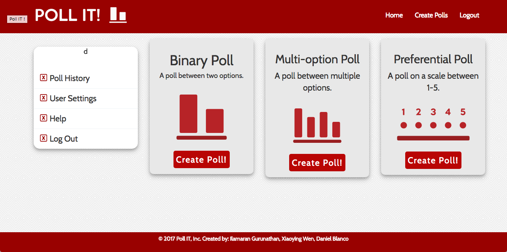
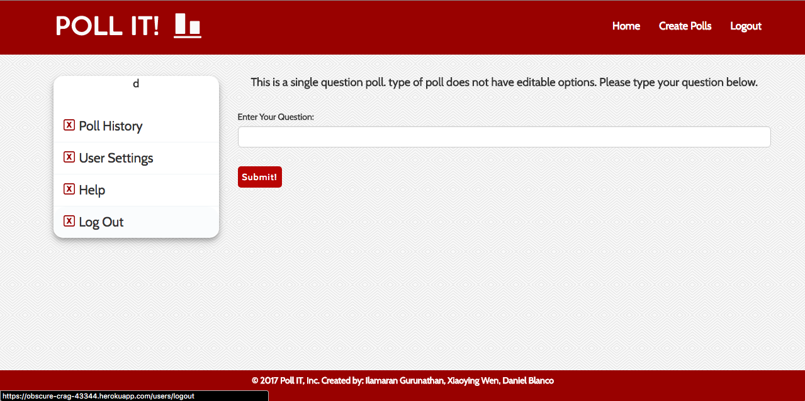
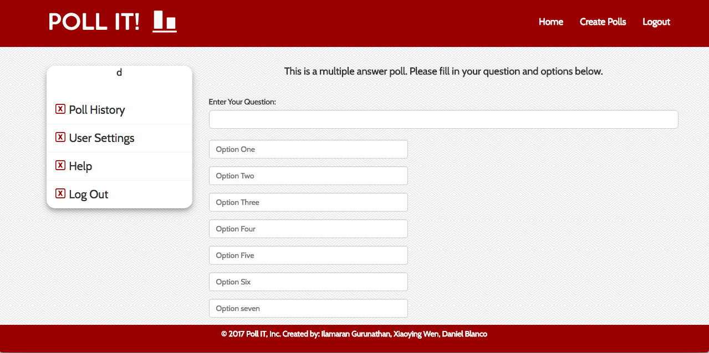
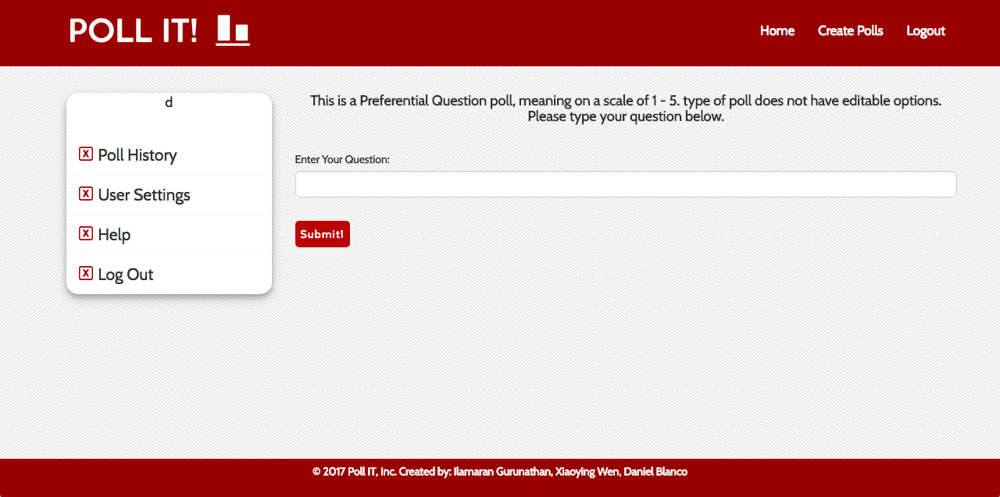
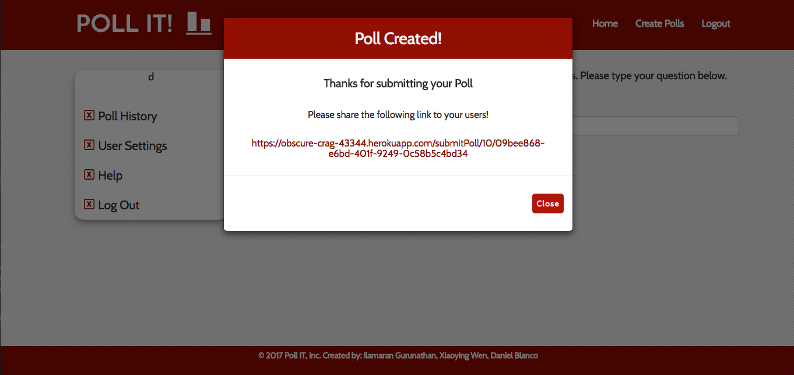
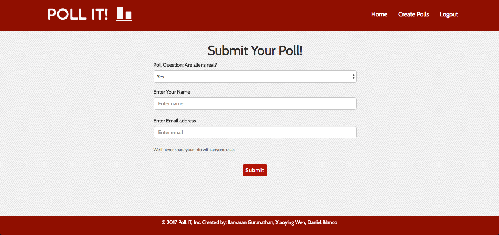
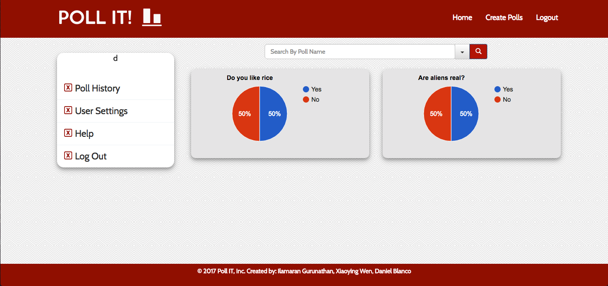

# Poll it!

A user authenticated poll creation app. The user can create a poll of their choosing and have other users cast their votes. The application will then calculate the poll and display the results in google charts.


## Technologies used:

- HTML
- CSS
- Javascript
- Node JS
- MySQL


## NPM Packages used:

- bcryptjs
- body-parser
- connect-flash
- cookie-parser
- express
- express-breadcrumbs
- express-handlebars
- express-messages
- express-session
- express-validator
- mysql
- nodemon
- passport
- passport-http
- passport-local
- sequelize
- uuid
- webpack


## Version

1.1.0


## Usage

#### The landing page will allow the user to create a new account or log in to an existing one.


#### Once the user is logged in, he/she has the option to create 3 different types of polls:
1. A binary poll - A poll that asks a question and calls for either an agree or disagree response.
2. A multiple option poll - A poll that asks a question and allows the user to determine the choices and how many choices (up to 4).
3. A preferrential poll = A poll that asks a question and calls for a preference choice on a scale of 1-5.



#### Binary poll:



#### Multi poll:



#### Preferential poll:



#### After the user creates the poll, they will get a link to send it out.



#### Other users can then vote on the poll.



#### The results are then displayed on the logged in users dashboard in a google pie chart.




### Link to the live site

https://obscure-crag-43344.herokuapp.com/users/login


### Installation

Loginapp requires [Node.js](https://nodejs.org/) v4+ to run.


```sh
$ npm install
```

```sh
$ npm start
```
